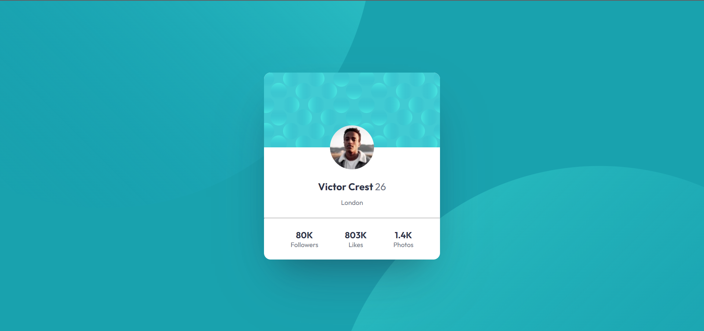

# Frontend Mentor - Profile card component

## Welcome! 👋

Thanks for checking out this front-end coding challenge.

[Frontend Mentor](https://www.frontendmentor.io) challenges help you improve your coding skills by building realistic projects. 

**To do this challenge, you need a basic understanding of HTML and CSS.**

### Links
- Challange URL: [here](https://www.frontendmentor.io/challenges/profile-card-component-cfArpWshJ)
- Solution URL: [here](https://github.com/ismanolgarcia/web-projects-to-practice/tree/main/profile-card-component)

- Live Site URL: [here](https://web-projects-to-practice.vercel.app/profile-card-component/index.html)

### Built with
- Semantic HTML5 markup
- CSS
- Vanilla JS

### Author
- Ismanol García
