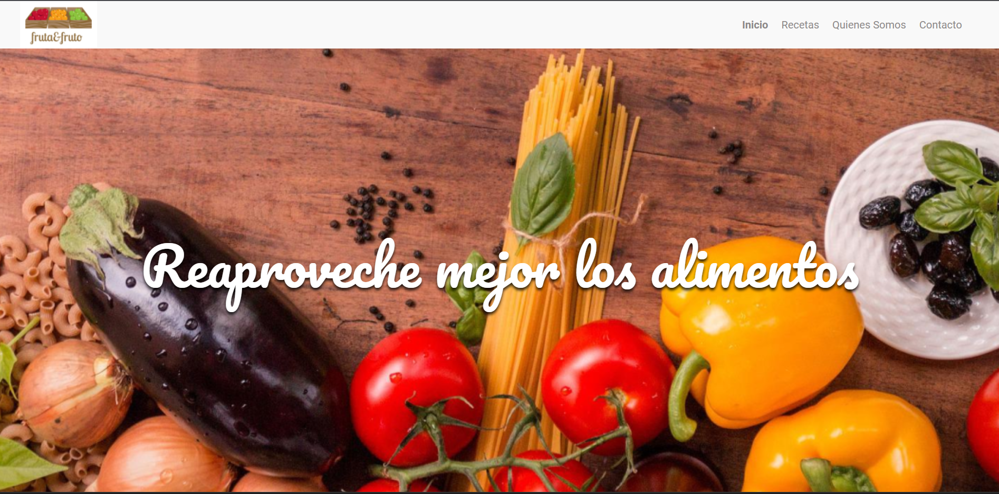

# Gallery Cards

## Welcome! 👋

Thanks for checking out this front-end coding challenge.

[alura design](https://www.figma.com/file/gBbiaKFQBeQ8tENigUuh0l/Alura-Latam-Arquitectura-CSS) challenges help improve my coding skills by building projects.

**To do this challenge, need a basic understanding of HTML, CSS y JavaScript.**
### Links
- Challange URL: [here](https://www.figma.com/file/gBbiaKFQBeQ8tENigUuh0l/Alura-Latam-Arquitectura-CSS)
- Solution URL: [here](https://github.com/ismanolgarcia/web-projects-to-practice/tree/main/2.1-web-page-fruits)
- Live Site URL: [here](https://web-projects-to-practice.vercel.app/2.1-web-page-fruits/index.html)

### Built with
- Semantic HTML5 markup
- CSS
- Vanilla JS

### Author
- Ismanol García