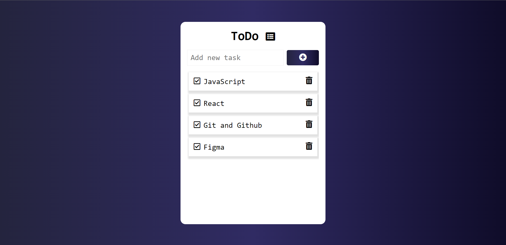

# Gallery Cards

## Welcome! 👋

Thanks for checking out this front-end coding challenge.

[alura design]() challenges help improve my coding skills by building projects.

**To do this challenge, need a basic understanding of HTML, CSS y JavaScript.**

### Links

- Challange URL: [here](#)
- Solution URL: [here](https://github.com/ismanolgarcia/web-projects-to-practice/tree/main/2.2-todoapp/index.html)
- Live Site URL: [here](https://web-projects-to-practice.vercel.app/2.2-todoapp/index.html)

### Built with

- Semantic HTML5 markup
- CSS
- Vanilla JS

### Author

- Ismanol García
