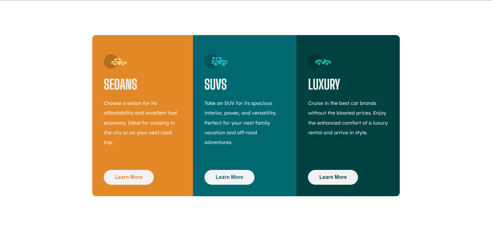

# Frontend Mentor 3-column preview card

## Welcome! 👋

Thanks for checking out this front-end coding challenge.

[Frontend Mentor](https://www.frontendmentor.io) challenges help you improve your coding skills by building realistic projects.

**To do this challenge, you need a basic understanding of HTML and CSS.**

### Links

- Challange URL: [here](https://www.frontendmentor.io/challenges/3column-preview-card-component-pH92eAR2-)
- Solution URL: [here](https://github.com/ismanolgarcia/web-projects-to-practice/tree/main/3-column-preview-card)

- Live Site URL: [here](https://web-projects-to-practice.vercel.app/3-column-preview-card/index.html)

### Built with

- Semantic HTML5 markup
- CSS
- Vanilla JS

### Author

- Ismanol García
