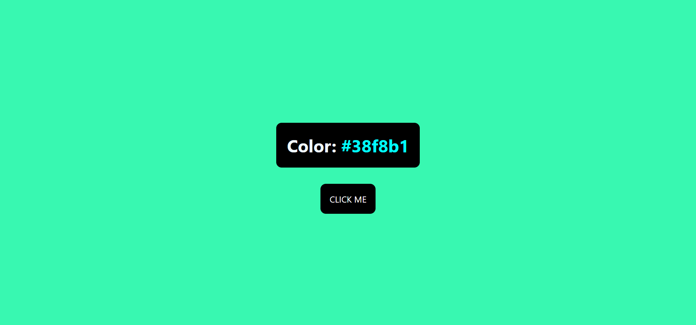

# Color Flipper

## Welcome! 👋

Thanks for checking out this front-end coding challenge.

[FreeCodeCamp](https://www.freecodecamp.org/news/javascript-projects-for-beginners/) challenges help improve my coding skills by building projects.

**To do this challenge, need a basic understanding of HTML, CSS y JavaScript.**

### Links
- Challange URL: [here](https://www.freecodecamp.org/news/javascript-projects-for-beginners/#how-to-create-a-color-flipper)
- Solution URL: [here](https://github.com/ismanolgarcia/web-projects-to-practice/tree/main/color-flipper)
- Live Site URL: [here](https://web-projects-to-practice.vercel.app/color-flipper/index.html)

### Built with
- Semantic HTML5 markup
- CSS
- Vanilla JS

### Author
- Ismanol García
